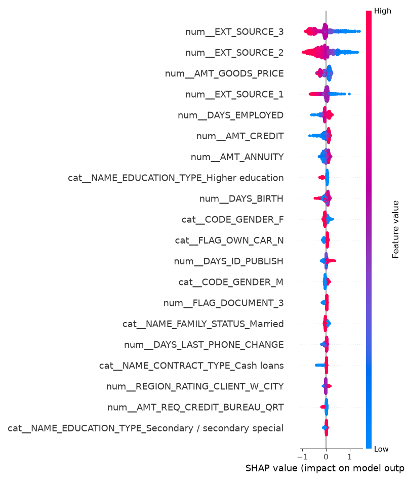

# Loan Default Predictor API

A machine learning API that predicts the probability of loan default using applicant information. The model is trained on the Home Credit Default Risk dataset and deployed as a FastAPI service using Docker and Render.

## Key Results

* Trained an XGBoost classifier on 300K+ loan applications
* Achieved a ROC-AUC score of 0.76 on the test set
* Deployed as a public REST API using FastAPI, Docker, and Render
* Implemented SHAP-based explainability to identify key drivers of loan default risk

## Live Demo

**API Base URL**

https://loan-default-predictor-fauu.onrender.com

**Interactive API Documentation**

https://loan-default-predictor-fauu.onrender.com/docs

## Key Features

* Loan default prediction using XGBoost
* Data preprocessing and feature engineering pipeline
* SHAP-based model explainability
* FastAPI REST API
* Automatic request validation with Pydantic
* Docker containerization
* Cloud deployment using Render
* Interactive Swagger/OpenAPI documentation

## Project Overview

This project implements an end-to-end machine learning pipeline for credit risk assessment using the Home Credit Default Risk dataset.

The workflow includes:

* Data cleaning and preprocessing
* Missing value handling
* Feature engineering
* Model training using XGBoost
* Model explainability using SHAP
* API development with FastAPI
* Containerization using Docker
* Cloud deployment on Render

The deployed API accepts applicant information and returns the predicted probability of loan default.

## Dataset

**Home Credit Default Risk Dataset**

* ~307,000 loan application records
* Binary classification problem

Target variable:

* `TARGET = 1` → Client experienced payment difficulties
* `TARGET = 0` → Client repaid successfully

## Model Performance

| Metric  | Score |
| ------- | ----- |
| ROC-AUC | 0.76  |

## Tech Stack

* Python
* Pandas
* NumPy
* Scikit-Learn
* XGBoost
* SHAP
* FastAPI
* Pydantic
* Docker
* Render
* GitHub

## Model Explainability

SHAP (SHapley Additive exPlanations) was used to interpret model predictions and identify the most influential features.

The summary plot below highlights the features that contribute most strongly to loan default risk predictions.



## API Endpoint

### Predict Default Probability

**POST** `/predict`

Example Request

```json
{
  "AMT_INCOME_TOTAL": 150000,
  "AMT_CREDIT": 500000,
  "AMT_ANNUITY": 25000,
  "AMT_GOODS_PRICE": 12000
}
```

Example Response

```json
{
  "default_probability": 0.5205
}
```

## Project Structure

```text
loan-default-predictor/
│
├── api/
├── data/
├── models/
├── notebooks/
├── src/
├── tests/
├── Dockerfile
├── requirements.txt
└── README.md
```

## Future Improvements

* Add batch prediction support
* Build a frontend dashboard
* Improve feature engineering
* Add monitoring and logging for deployed predictions

## Author

Siya Kothari


